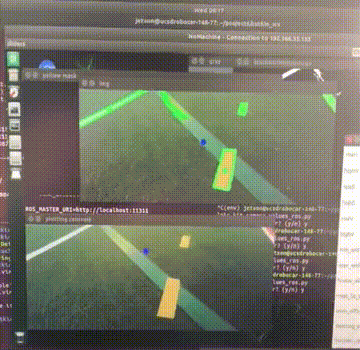

#__Self-Driving RC Car Powered by JETSON NANO__
👑   __Featured on [NVIDIA community Jetson Projects page](https://developer.nvidia.com/embedded/community/jetson-projects#mjolnir_autonomous_1_10_ros_car)__   👑  

[__Documentation__   📑](https://guitar.ucsd.edu/maeece148/index.php/2021SpringTeam1){ .md-button .md-button--primary } [__Mjolnir Kit__ - GitHub :fontawesome-brands-github:](https://github.com/ArthurDassier/Mjolnir_kit){ .md-button .md-button--primary }

##__So..what is this? 🤔__  
Meet Harold   :red_car:  , an RC Car, capable of driving autonomously whilst maintaining itself on the track, and switch lanes when needed.  

*Harold 🚗*

  

 

*Harold driving 3 laps in a challenging curvy track, like a boss   😎*

---

##__Features   🌟__  
!!! info inline end

    This is just a very brief write-up of the project. __The full, detailed, documentation
    can be found [here](https://guitar.ucsd.edu/maeece148/index.php/2021SpringTeam1)__  

- Uses a custom __ROS Package__ which utilizes [__OpenCV__](https://opencv.org/), we call it [__Mjolnir Kit__](https://github.com/ArthurDassier/Mjolnir_kit), allowing it to __detect lines and lanes__, to stay on the track and to switch lanes when needed.  
👉  [__:fontawesome-brands-github-square: GitHub__](https://github.com/ArthurDassier/Mjolnir_kit)
- The brain of the car is the powerful [__Jetson NANO__](https://developer.nvidia.com/embedded/jetson-nano-developer-kit).
- It also features a [__PID Controller App__](https://guitar.ucsd.edu/maeece148/index.php/2021SpringTeam1#Phone_App), which allows user to __tune the PID of the car__, live while it's driving. This is achieved via [__MQTT protocol__](https://mqtt.org/) and a [__PID Controller class__](https://github.com/ArthurDassier/Mjolnir_kit/blob/master/scripts/class_PIDController.py).
- A __custom PCB board__ for __power distribution__ and an __LED board__ to add aesthetics to our car.  

*a sneak peek of the [__Mjolnir Kit__](https://github.com/ArthurDassier/Mjolnir_kit)*

---

##__Official Documentation   📑__  
The official documentation is currently hosted [__here__](https://guitar.ucsd.edu/maeece148/index.php/2021SpringTeam1), though I am considering to document it on this project page too. So, stay tuned!

---

##__Meet Harold's Engineers   👬👬__  

*From left: [__@George Troulis__](https://www.linkedin.com/in/george-troulis/)(Computer Engineering), [__@Arthur Dassier__](https://www.linkedin.com/in/arthurdassier/)(Computer Science), [__@Myself__](https://www.linkedin.com/in/mfarsani/)(Electrical Engineering), [__@Dev Gulati__](https://www.linkedin.com/in/devgulati/)(Mechanical Engineering)* 

 

__For full, detailed, documentation, consult our documentation page [here](https://guitar.ucsd.edu/maeece148/index.php/2021SpringTeam1).__

