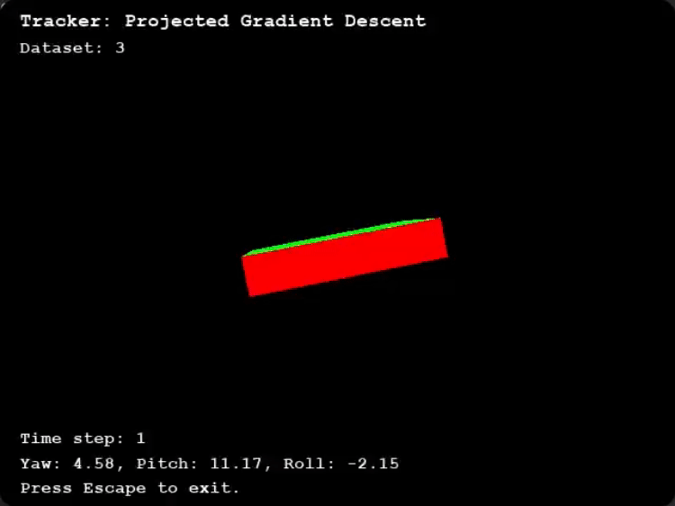
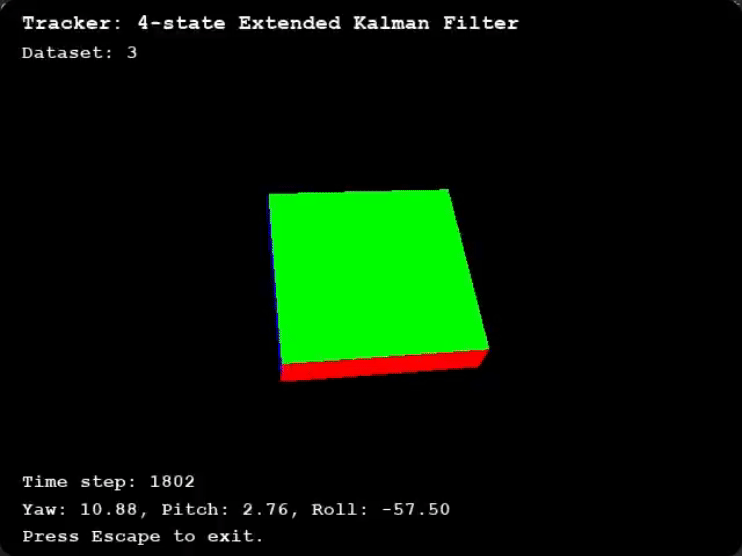
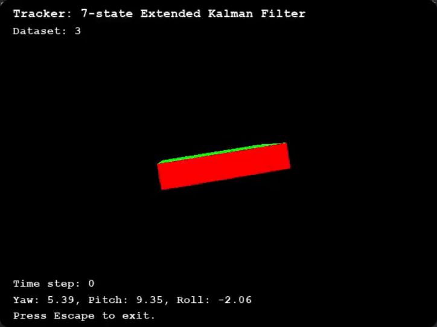
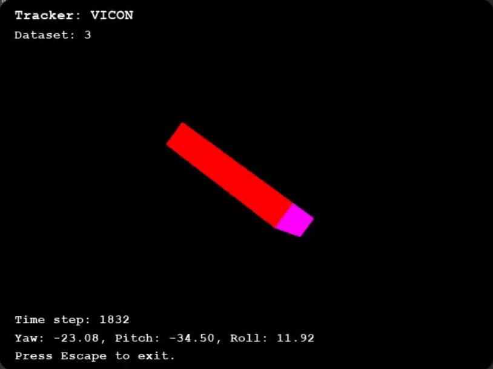

---
hide:
  - navigation
  - toc
---

# __Experiences__ 💼

    

        
        

            <h3><b>Moss Robotics Inc.</b></h3>
            <h4><b>Perception Software Engineer Intern (Autonomous Driving)</b></h4>
            <h6>July 2023 - September 2023</h6>
        

    

    

        
        

            <h3><b>Existential Robotics Lab at Contextual Robotics Institute UC San Diego</b></h3>
            <h4><b>Research Software Engineer</b></h4>
            <h6>January 2023 - current</h6>
        

    

    

        
        

            <h3><b>Autonomy Lab at Contextual Robotics Institute UC San Diego</b></h3>
            <h4><b>Research & Software Engineer Intern</b></h4>
            <h6>March 2022 - September 2022</h6>
        

    

<!-- Modal structure (hidden initially) -->

  

    &times;
        <h3><b>Moss Robotics Inc.</b></h3>
        <h4><b>Perception Software Engineer Intern (Autonomous Driving)</b></h4>
        <h6>July 2023 - September 2023</h6>
        Worked as a software engineer intern working on the robot's perception system for autonomous driving.
        <ul>
            <li>Overcome limitations of single-scan <b>LiDAR</b> data by implementing a <b>point cloud accumulator</b> module.</li>
            <li>Enhanced <b>trees/plants tracking and detection</b> by implementing <b>fast real-time data association algorithm</b>.</li>
            <li>Improved <b>tree detection</b> and <b>row-following</b> accuracy with <b>deep learning (YOLO)</b> and <b>parallel line fitting</b>.</li>
            <li>Automated <b>trees/pots counting</b> through <b>tree block identification</b> by introducing a <b>graph-based approach</b>.</li>
            <li>Optimized real-time performance and efficiency by leveraging <b>ROS2 Components</b> and using <b>Behavior Trees</b>.</li>
            <li>Developed all the software <b>entirely in C++</b>.
        </ul>
  

  

    &times;
        <h3><b>Existential Robotics Lab at Contextual Robotics Institute UC San Diego</b></h3>
        <h4><b>Research Software Engineer</b></h4>
        <h6>January 2023 - current</h6>
        Working on open-source implementations and 3D visualizations of baseline robotics algorithms for localization, mapping, and controls using PyBullet real-time physics simulation. This research project is under <a href="https://natanaso.github.io/">Professor Nikolay Atanasov</a>.
        <ul>
            <li>Built implementations & visualizations of <b>mobile robot algorithms</b> for <b>localization</b>, <b>mapping</b>, & <b>controls</b>.</li>
            <li>Implemented various robotics algorithms like <b>Particle Filter</b>, <b>SLAM</b>, <b>A* search</b>, etc.</li>
            <li>Programmed a <b>navigation environment</b> in <b>PyBullet real-time physics simulation engine</b>.</li>
        </ul>
  

  

    &times;
        <h3><b>Autonomy Lab at Contextual Robotics Institute UC San Diego</b></h3>
        <h4><b>Research & Software Engineer Intern</b></h4>
        <h6>March 2022 - September 2022</h6>
        Worked as a software engineering intern and an undergraduate research intern for a Research Project at a Robotics Lab in the Jacobs School of Engineering at UC San Diego. The research was on Vision-Guided Quadrupedal Locomotion under <a href="https://xiaolonw.github.io/">Professor Xiaolong Wang</a> group.
        <ul>
            <li>Deployed <b>Reinforcement Learning policy</b> on <b>Unitree A1</b> robot allowing it to navigate challenging terrains.</li>
            <li>Worked with a <b>depth camera (Intel RealSense D435)</b> and other sensors on the robot.</li>
            <li>Collected <b>real-world data</b> to bridge the gap between <b>Sim2Real</b> and uncertainties in the real world.</li>
            <li>Utilized <b>GPU clusters</b> and other MLOps tools like <b>Kubernetes</b> and <b>WANDB</b> to train the models.</li>
        </ul>
  

 

# __Projects__ 🛠

  

    <h1>Robust Orientation Tracking for Panoramic Stitching: Projected Gradient Descent vs. Extended Kalman Filters</h1>
  

    

      
      
      
      
    

  

    &times;
        

            
<b>Abstract</b>

            
<a href="paper.pdf">Paper</a>

            
The quest for precise 3D orientation tracking of
            rotating bodies underpins advancements in robotics, augmented
            reality, and navigational systems, necessitating methodologies
            that balance accuracy with computational feasibility. This paper
            introduces a projected gradient descent (PGD) methodology,
            innovatively applied to orientation estimation through sensor
            fusion from a 6-DOF inertial measurement unit (IMU). We
            undertake a comparative analysis of PGD against established
            Extended Kalman Filter (EKF) methods—specifically, 4-state and
            7-state variants—anchored by ground truth data from a VICON
            motion capture system. Our investigation reveals PGD’s superior
            accuracy and robustness over EKF approaches across a spectrum of datasets
            characterized by noise, discontinuities, and dynamic changes.
            Despite PGD’s reliance on future data, which poses a challenge
            for real-time application, its performance advantage is notable,
            especially in complex environments. The 7-state EKF, while
            outperforming PGD in scenarios with frequent discontinuities,
            exhibits limitations in smoothness, highlighting a trade-off
            between responsiveness and continuity. The practical utility of
            these orientation estimation methods is further demonstrated
            through the application of panoramic image stitching, where
            PGD’s enhanced performance is evident, although EKF models
            provide comparable outcomes under less variable conditions.
            This study underscores PGD’s potential as a robust alternative
            for 3D orientation tracking, offering insights into its comparative
            performance against traditional EKFs. By delineating
            the strengths and limitations of PGD and EKF methodologies,
            this work contributes to the broader discourse on advancing
            sensor-based orientation estimation, encouraging future efforts
            to optimize PGD for real-time applications.

        

  

 

    

        
        

            <h3><b><a href="Projects/AutonomousRCCar/">SELF-DRIVING RC CAR  🚗</a></b></h3>
            <h6>An RC Car, powered by Jetson Nano and a custom ROS package, capable of driving autnomously, keeping itself on track and change lanes when needed.</h6>
        

    

    

        
        

            <h3><b><a href="Projects/GameController/">GAME CONTROLLER  🎮</a></b></h3>
            <h6>A game controller made with ESP32, accelerometer, OLED display, and more. It's capable of playing both Space Invader and Mine Sweeper game.</h6>
        

    

    

        
        

            <h3><b><a href="Projects/SmartWearable/">SMART WEARABLE  ⌚</a></b></h3>
            <h6>This wearable has multiple features, such as measuring heart rate and steps count, retrieving real-time weather forecast, and showing time & date.</h6>
        

    

